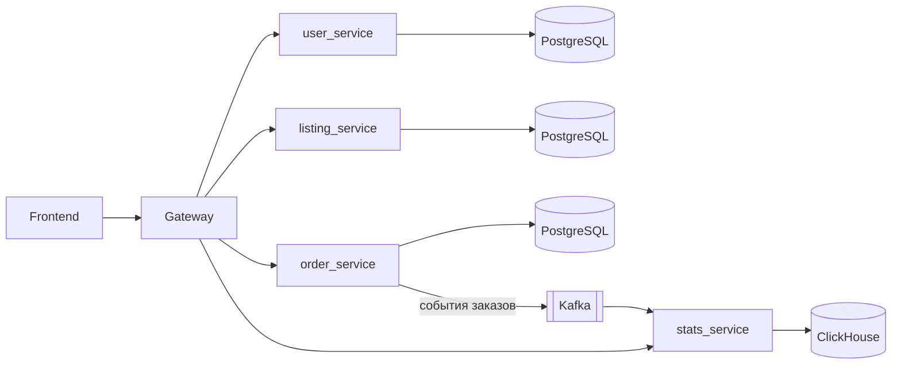

# AtriumMarket

## Про проект

Технологии: C++, userver, testsuite, posqtgresql, clickhouse, kafka, Docker.

Это маркетплейс с ролями покупатель и продавец.

Аутентификация пользователей реализована через JWT токены.

Микросервисная архитектура на userver: есть gateway и 4 микросервиса: пользователи (регистрация и аутентификация), товары (добавление товаров), заказы (корзина и заказы) и статистика (статистика для продавцов)

Для продавцов:
- добавление товаров, возможны вариации одного товара (товары хранятся в posqtgresql)
- отслеживание заказов своих товаров и изменение статусов доставки (информация о заказах публикуется в топик Kafka, для статистики). Сами заказы хрянятся в postgresql
- статистика заказов (данные хранятся в Clickhouse, микросервис получает информацию из Kafka)

Для покупателей:
- просмотр товаров (просмотр всех товаров всех продавцов, кроме скрытых)
- Добавление в корзину (корзина - это просто еще одно состояние заказа)
- Заказ товаров (для заказов реализована смена статусов, их может менять продавец)

Для всех пользователей:
- регистрация
- изменение профиля

Написаны тесты на testsuite и настроен CI/CD

Фронтенд написан с помощью Claude. Также он использован для дебага и преодоления "белого листа"





## Тесты

Зайти в контейнер:

```bash
bash shell.sh
```

Дальше внутри:

```bash
cmake --build build -j$(nproc)                         # собрать всё


ctest --test-dir build --output-on-failure              # прогнать тесты всех сервисов


ctest --test-dir build -R gateway --output-on-failure    # только тесты gateway


build/gateway/runtests-gateway -k test_ping -v --no-header -p no:cacheprovider --color=yes                        # один конкретный тест, читаемый вывод
```

